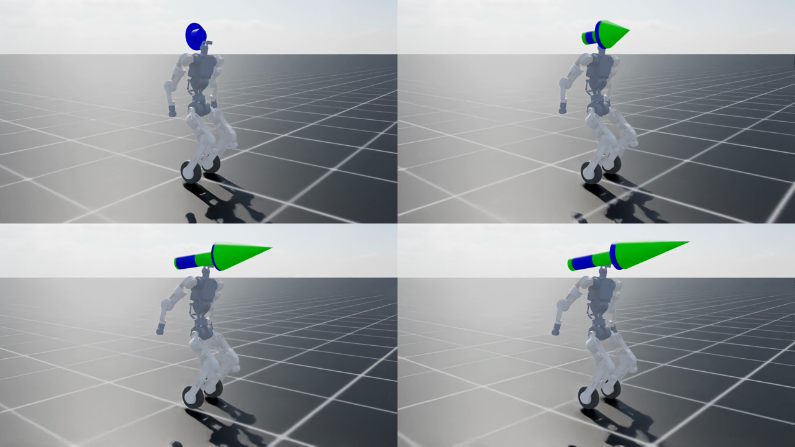

# Q1 Wheel (BI2 Wheel) URDF + Isaac Lab inline-skate RL

Quanta Q1 / BI2 wheeled-legged humanoid: ~1.4 m, **40 kg**, 24 CubeMars quasi-direct-drive joints, two
**actuated** Ø200 mm inline wheels, Xsens MTi-630 IMU on the pelvis, 200 Hz CAN. Trained in Isaac Lab
(Isaac Sim 5.1 / PhysX, RSL-RL PPO) to skate like the
[AgiBot Lingxi X2](https://www.youtube.com/watch?v=oJZ8tMIYlY4) (swizzle, forward lean, arms back,
micro-lift), with a sim2real-oriented plant instead of ideal PD.

```
config/q1_wheel_components.yaml   hardware sheet: motor SKUs, joint->motor map, IMU, CAN, wheel, mass target
docs/motors.md                    CubeMars datasheet numbers, assumptions, mass budget, sim actuator model
docs/spec/                        BI2 Wheel motor overview slide
docs/reference/                   X2 skate clip (1:45-2:00) + MediaPipe joint-angle trace + Q1 keyframe
urdf/wheel_humanoid_structural.urdf   CAD geometry + uniform-density masses (hand edited)
urdf/wheel_humanoid.urdf              GENERATED: tools/build_urdf.py (motors, 40 kg, imu_link, neck/wrist/gripper)
source/wheel_humanoid_lab/wheel_humanoid_lab/
  actuators/cubemars.py           CubeMarsActuator: V/I-limited BLDC + friction budget + delay + sag + DR
  assets/q1_spec.py               24-D joint contract, command block widths, SKU helpers
  assets/wheel_humanoid.py        Q1_WHEEL_CUBEMARS_CFG (actuator groups by SKU), skate stance keyframe
  tasks/manager_based/skate/      Isaac-Q1-Skate-v0: obs/action contract, rewards, curriculum, DR
tests/test_skate_contract.py      obs/action/actuator contract unit test (Isaac Sim, 4 envs)
train_skate.sh / run_isaac.sh     training + generic Isaac Sim runner
```

## Quick start

```bash
python tools/build_urdf.py                          # regenerate urdf/wheel_humanoid.urdf from the YAML
./run_isaac.sh tests/test_skate_contract.py         # contract test (must print ALL CHECKS PASSED)
NUM_ENVS=64 MAX_ITERS=5 ./train_skate.sh            # smoke test: reward names appear in the log
./train_skate.sh                                    # 4096 envs, curriculum stages 0-5 (see below)
./run_isaac.sh scripts/reinforcement_learning/rsl_rl/play.py --task Isaac-Q1-Skate-Play-v0 \
    --checkpoint logs/rsl_rl/q1_skate_cubemars/<run>/model_<n>.pt          # WASD teleop, exports ONNX
```

## Observation / action contract (hot-swappable)

Actor (92-D, float32, observation normalization ON and baked into the exported ONNX/JIT):

| block | dims | source |
|---|---|---|
| `imu_gyro` | 3 | MTi-630 on pelvis, 0–2 step delay, ±6° mounting tilt DR, noise |
| `imu_projected_gravity` | 3 | same IMU (not raw accel) |
| `joint_pos - default` | 24 | `Q1_JOINT_ORDER`, ±1.5° encoder bias, wheel angles wrapped to [-π, π) |
| `joint_vel` | 24 | 1 policy-step delay |
| `last_action` | 24 | unfiltered |
| command `twist` | 3 | `[vx, vy=0, yaw]` |
| command `head` / `body` | 4 / 6 | zero padded, reserved |
| command `arm_style` | 1 | 1 = arms-back skate |

Action (24-D): 22 position targets in `Q1_JOINT_ORDER` (wrist/gripper scale 0 = frozen) + 2 wheel
velocity targets (`l_wheel_joint`, `r_wheel_joint`, ×25 rad/s). Critic additionally sees base lin vel,
height, wheel rim speed, wheel normal force and air time. Control 50 Hz, PhysX 200 Hz (= CAN rate).

`Q1_JOINT_ORDER` = waist yaw/roll/pitch, neck, L shoulder p/r/y, L elbow, L wrist, L gripper, R shoulder
p/r/y, R elbow, R wrist, R gripper, L hip pitch/roll, L knee, R hip pitch/roll, R knee, L wheel, R wheel.

## Curriculum (`SKATE_STAGES`, PPO iterations)

| stage | from iter | what changes |
|---|---|---|
| 0 | 0 | stand/balance on two wheels, vx_cmd = 0, both wheels down |
| 1 | 300 | wheel-driven glide 0–0.6 m/s |
| 2 | 900 | swizzle: `leg_symmetry` 1.0, yaw ±0.3, braking −0.3 m/s, heading 0.5 |
| 3 | 1600 | `forward_lean` (torso gx target 0.17) + `arms_back` keyframe |
| 4 | 2400 | `skating_air_time` 0.3 (micro-lift 50–250 ms), vx up to 1.5 m/s |
| 5 | 3400 | pushes ±0.5 m/s, CoM DR ±3 cm, heading 1.0, vx up to 1.8 m/s |

`action_rate_l2` ramps −0.05 → −0.3 (iter 1500) → −0.6 (iter 4000). Reward names that must appear in
the log: `wheel_speed, leg_symmetry, grounded, forward_lean, arms_back, skating_air_time` (0 until stage 4).
Debug metrics under `Curriculum/metrics/*`: wheel ω, longitudinal/lateral slip, both/single contact
fraction, peak air time, torso pitch, shoulder pitch, AKE90 saturation %.

Terminations: trunk tilt > 0.6 rad, pelvis z < 0.60 m, torso/pelvis/arm/thigh ground contact, 20 s
time-out. Resume in a later stage with `RESUME=1 CHECKPOINT=... START_ITER=<iter> ./train_skate.sh`.

## Results (run `skate_cubemars_4096_v2`, 4096 envs, stage 5 reached at iter 3400)

[`docs/results/q1_skate_cubemars_iter3800.mp4`](docs/results/q1_skate_cubemars_iter3800.mp4) — 12 s
headless play of `checkpoints/q1_skate_ppo.pt` (iter 3800): coast 2 s → 0.6 → 1.2 → 1.5 m/s, heading
held at 0 through the yaw command. 8.15 m travelled, no fall, pelvis 0.75 m, final body vx 1.28 m/s.



Training metrics at iter 3700 (stage 5, pushes + CoM DR on): torso `projected_gravity_x` 0.164
(target 0.17), shoulder pitch 0.575 rad (keyframe 0.55), `leg_symmetry` 0.87, both-wheel contact 99.4 %,
wheel rim speed = base speed (0.456 vs 0.465 m/s → no sliding cheat), AKE90 saturation 0.1 %, mean
action std 0.19, 6.7 % of episodes terminated (pushes). Micro-lift has not emerged yet
(`skating_air_time` 0, single-contact 0.5 %); it is a weak late term by design and the run continues
to 20k iterations.

```bash
CHECKPOINT=logs/rsl_rl/q1_skate_cubemars/<run>/model_<n>.pt ./record_skate.sh   # new video
./record_skate.sh                                                             # checkpoints/q1_skate_ppo.pt
```

Exported policy with the observation normalizer baked in: `checkpoints/exported/q1_skate_policy.onnx`
(input `obs[1,92]` → `actions[1,24]`) and `q1_skate_policy.pt` (TorchScript).

### Lessons from run 1 (kept so they are not repeated)

- **Do not clip actions in the RL wrapper.** With `clip_actions=1.0` the policy pushed its means far
  outside [-1, 1]; the clipped action was then noise-free bang-bang, `action_rate_l2` saw ~0 and the
  entropy bonus grew the per-joint std to ~2.5 (arms flailing, `arms_back`/`forward_lean` ≈ 0). The
  bound now lives in joint space on the action terms (`default ± scale`, wheels ±25 rad/s), the raw
  action is penalised (`action_l2`), and std settles around 0.2. The runtime must apply the same clamp.
- Gaussian style rewards need a gradient from the starting pose: `forward_lean` std 0.12 (not 0.06),
  `arms_back` uses the per-joint RMS error (std 0.45 rad) instead of a sum over joints.
- `entropy_coef` 0.005 (spec said 0.01–0.03; 0.01 was part of the std runaway above).

---

# wheel_humanoid URDF (기하 구조 노트)

`URDF_Data_ME_stl_Update_20260911`의 STL 22개로 만든 URDF입니다. 이 STL 세트에는 관절 정보가 없어서, 각 관절 위치는 메쉬 형상을 보고 추정했습니다.

- 자유도: 능동 관절 19개(허리 3, 팔 4×2, 다리 3×2, 바퀴 2) + 무릎 연동 롤러 2개(mimic 관절, 독립 자유도 아님)
- 좌표계: X 전방, Y 왼쪽, Z 위쪽, 단위 m. 베이스 링크 `pelvis`의 원점은 골반 상면(허리 yaw 모터 면)
- 0 자세의 전체 높이는 1.358 m이고, 바퀴 최하단은 pelvis 원점에서 0.8867 m 아래입니다.

## 폴더 구성
```
urdf/wheel_humanoid.urdf        메쉬 경로는 ../meshes/... 상대경로
meshes/visual/                  원본 STL (파일명 그대로)
meshes/collision/               링크별 볼록 껍질(≤1500면). 바퀴와 롤러는 실린더 프리미티브
isaaclab/wheel_humanoid_cfg.py  ArticulationCfg 템플릿
tools/set_masses.py             질량 보정 (전체 질량 스케일 또는 CAD 값 입력)
tools/link_masses.csv           링크별 추정 질량 (cad_mass_kg 열을 채워서 사용)
```

## 관절 위치를 정한 방법
각 모터의 축은 단면 원 피팅으로 찾았고, 축 방향 위치는 출력 플랜지 면과 자식 링크 플랜지 면을 맞춰서 정했습니다.
아래 항목들로 추정이 맞는지 교차 확인했습니다.

- **무릎**: 허벅지 쪽 기어(치폭 6 mm)와 정강이 쪽 기어의 치면이 오프셋 30 mm에서 정확히 일치합니다. 반대편의 허벅지 보조축(r 9.7)도 정강이 판의 베어링 구멍(r 9.75)에 들어갑니다.
- **바퀴**: 정강이 쪽 베어링 링(r 55)과 바퀴 내경(r 54.9)이 오프셋 26 mm에서 겹칩니다.
- **허리**: 십자축(U-조인트)의 축 길이가 요크 베어링과 대칭으로 맞습니다. 상체 푸시로드 끝단과 waist_yaw 소켓 사이의 오차도 0.2 mm 이내입니다.
- **어깨·팔꿈치**: Ø98 모터의 후면(출력) 위치를 다른 링크의 같은 모터와 대조해서 정했습니다. 그 결과 상완이 어깨 roll 모터 바로 아래(x 오차 0.07 mm)에 옵니다.
- **고관절**: Ø107 모터의 출력 허브 끝면과 자식 링크의 센터링 립 위치를 맞췄습니다. hip roll은 후면 스터브와 허벅지 보어의 위치도 일치합니다.

| 관절 | 부모 → 자식 | 원점 xyz (mm) | 축 | 한계 (rad, 임시) | 토크 N·m / 속도 rad/s (임시) |
|---|---|---|---|---|---|
| `waist_yaw_joint` | pelvis → waist_yaw_link | 0.00, 0.00, 0.00 | Z | -1.57 ~ 1.57 | 30 / 10 |
| `waist_roll_joint` | waist_yaw_link → waist_roll_link | 0.00, 0.00, 37.80 | X | -0.35 ~ 0.35 | 40 / 6 |
| `waist_pitch_joint` | waist_roll_link → torso | 0.00, 0.00, 0.00 | Y | -0.52 ~ 0.52 | 40 / 6 |
| `l_shoulder_pitch_joint` | torso → l_shoulder_pitch_link | 0.00, 140.50, 256.00 | Y | -3.14 ~ 3.14 | 30 / 10 |
| `l_shoulder_roll_joint` | l_shoulder_pitch_link → l_shoulder_roll_link | -30.19, 75.00, 0.00 | X | -0.2 ~ 2.6 | 30 / 10 |
| `l_shoulder_yaw_joint` | l_shoulder_roll_link → l_shoulder_yaw_link | 30.12, 0.00, -141.70 | Z | -1.57 ~ 1.57 | 30 / 10 |
| `l_elbow_joint` | l_shoulder_yaw_link → l_elbow_link | 0.00, 30.00, -120.00 | Y | -2.5 ~ 0.2 | 30 / 10 |
| `r_shoulder_pitch_joint` | torso → r_shoulder_pitch_link | 0.00, -140.50, 256.00 | Y | -3.14 ~ 3.14 | 30 / 10 |
| `r_shoulder_roll_joint` | r_shoulder_pitch_link → r_shoulder_roll_link | -30.19, -75.00, 0.00 | X | -2.6 ~ 0.2 | 30 / 10 |
| `r_shoulder_yaw_joint` | r_shoulder_roll_link → r_shoulder_yaw_link | 30.12, 0.00, -141.70 | Z | -1.57 ~ 1.57 | 30 / 10 |
| `r_elbow_joint` | r_shoulder_yaw_link → r_elbow_link | 0.00, -30.00, -120.00 | Y | -2.5 ~ 0.2 | 30 / 10 |
| `l_hip_pitch_joint` | pelvis → l_hip_pitch_link | 0.00, 84.00, -126.70 | Y | -1.8 ~ 1.2 | 60 / 12 |
| `l_hip_roll_joint` | l_hip_pitch_link → l_thigh_link | 27.00, 73.00, -98.00 | X | -0.35 ~ 0.8 | 60 / 12 |
| `l_knee_joint` | l_thigh_link → l_shin_link | -27.00, -30.00, -222.00 | Y | -0.2 ~ 2.6 | 60 / 12 |
| `l_wheel_joint` | l_shin_link → l_wheel_link | 0.00, 26.00, -340.00 | Y | 연속 | 20 / 30 |
| `r_hip_pitch_joint` | pelvis → r_hip_pitch_link | 0.00, -84.00, -126.70 | Y | -1.8 ~ 1.2 | 60 / 12 |
| `r_hip_roll_joint` | r_hip_pitch_link → r_thigh_link | 27.00, -68.00, -98.00 | X | -0.8 ~ 0.35 | 60 / 12 |
| `r_knee_joint` | r_thigh_link → r_shin_link | -27.00, 30.00, -222.00 | Y | -0.2 ~ 2.6 | 60 / 12 |
| `r_wheel_joint` | r_shin_link → r_wheel_link | 0.00, -26.00, -340.00 | Y | 연속 | 20 / 30 |
| `l_knee_roller_joint` | l_thigh_link → l_knee_roller_link | -27.00, -47.60, -222.00 | Y | -0.1 ~ 1.2 (mimic) | 60 / 12 |
| `r_knee_roller_joint` | r_thigh_link → r_knee_roller_link | -27.00, 47.10, -222.00 | Y | -0.1 ~ 1.2 (mimic) | 60 / 12 |

부호 규약: 좌우 관절의 축 방향을 같게 두었습니다(+X/+Y/+Z). 예를 들어 hip pitch는 음수일 때 다리가 앞으로 가고, knee는 양수일 때 정강이가 뒤로 접힙니다.

## 무릎 롤러 연동 기구
`lower_leg_*_w_link_1_2`의 기어는 72T(모듈 1) 섹터 기어이고, 무릎축과 같은 축에서 돕니다. 레버 끝에 롤러 2개(r 25 mm)가 달려 있습니다.

기어열은 정강이 52T(무릎축, 정강이에 고정) → 허벅지 복합 아이들러 52T/32T(무릎축에서 52 mm 위) → 롤러 섹터 72T 순서입니다.

- 아이들러와 무릎축 사이 중심거리 52 mm는 두 기어쌍의 피치반경 합과 모두 일치합니다(26+26, 16+36).
- 외접 맞물림이 두 번이라 롤러는 허벅지 기준으로 무릎과 같은 방향으로 돕니다. 비율은 32/72 = 0.444입니다.
- 정강이 기준으로 보면 롤러는 무릎 각도의 −0.556배만큼 앞쪽으로 회전합니다. 그래서 무릎을 접으면 롤러가 정강이 앞쪽(무릎 아래)으로 나옵니다.

URDF에는 `<mimic joint="*_knee_joint" multiplier="0.444444"/>`로 넣었고, 부모는 thigh입니다.
- Isaac Sim 4.5 이상의 URDF importer는 mimic을 PhysX mimic joint로 변환합니다. 그보다 이전 버전에서는 mimic이 무시되어 롤러가 자유 관절이 되므로, 해당 관절을 고정하거나 무릎 각도로 직접 구동해야 합니다.
- 액추에이터 그룹에는 넣지 않았습니다.

## 확인이 필요한 부분
1. **좌우 비대칭**: hip roll 모터 위치가 L +73 mm, R −68 mm로 5 mm 다릅니다. `05_urdf_thigh_joint_r.stl` 형상에 이 차이가 그대로 들어 있어서 그대로 반영했습니다. 의도한 설계인지 확인해 주세요.
2. **무릎 롤러 기어 정렬**: 롤러 레버의 축 방향 위치는 기어 치면 정렬로 정했습니다. 그런데 이 위치에서는 반대쪽 판(8.5 mm)이 허벅지 모터 후면 허브(r 35)와 약 3 mm 겹칩니다. 실제 조립 간격을 확인해 주세요.
3. **허리 병렬 기구**: 상체 안의 모터 2개와 푸시로드로 구동되는 구조를 직렬 yaw→roll→pitch로 단순화했습니다. 푸시로드는 상체 메쉬에 포함되어 있어서, 허리를 움직이면 상체와 함께 강체로 움직입니다.
4. **질량·관성**: 모든 링크에 균일 밀도 1000 kg/m³를 가정했습니다(총 18.39 kg). 모터나 금속부는 실제보다 가볍게 나오므로 `tools/set_masses.py`로 보정하세요.
5. **관절 한계·토크·속도·게인**: 모두 임시값입니다.
6. **충돌체**: 볼록 껍질이라 인접하지 않은 링크끼리 겹치는 곳이 있습니다(waist_yaw↔torso, 롤러↔정강이 등). self-collision을 끄고 쓰는 것을 권장합니다. 정밀한 충돌체가 필요하면 Isaac Lab URDF importer의 convex decomposition 옵션을 쓰세요.

## 사용법
```bash
# 질량 보정
python tools/set_masses.py --total 32.0                  # 실제 총질량으로 스케일
python tools/set_masses.py --csv tools/link_masses.csv   # cad_mass_kg 값을 채운 링크만 교체

# Isaac Lab URDF → USD 변환 (2.x)
./isaaclab.sh -p scripts/tools/convert_urdf.py urdf/wheel_humanoid.urdf wheel_humanoid.usd --joint-stiffness 0.0 --joint-damping 0.0
```
`isaaclab/wheel_humanoid_cfg.py`는 URDF를 직접 스폰하는 템플릿입니다. API 이름(`effort_limit_sim` 등)은 사용 중인 Isaac Lab 버전에 맞게 확인하세요.

## Isaac Lab standing-skate PPO (AgiBot Lingxi X2 style)

Trains an **upright two-wheel skate**: the robot stands on the two foot wheels, bends the knees only a little for balance, and rolls like [Lingxi X2](https://www.youtube.com/watch?v=oJZ8tMIYlY4). Knee rollers stay off the ground. PPO tracks planar velocity and matches wheel spin to commanded speed (differential yaw). WASD in Isaac Sim sends a world-frame direction; the policy turns to face that direction and rolls forward.

Requires the local Isaac Lab 2.3 env at `~/isaac/env_isaaclab` and `~/isaac/IsaacLab`.

```bash
# Train PPO (headless). Writes checkpoints/skateboard_ppo.pt
./train_skateboard.sh

# Resume the standing checkpoint and keep skating
RESUME=1 MAX_ITERS=3000 ./train_skateboard.sh

# Optional: fewer envs / fewer iters
NUM_ENVS=256 MAX_ITERS=500 ./train_skateboard.sh

# Play in Isaac Sim with WASD (focus the viewport first)
./play_skateboard.sh

# Headless RGB recording
./record_stand_skate.sh
```

Keyboard while playing:

| Key | Motion |
|---|---|
| W / S | Slide world +X / −X |
| A / D | Slide world +Y / −Y (left / right) |
| Q / E | Yaw in place |
| Space or L | Stop |
| R | Reset episode |

## 링크 ↔ 원본 STL
| 링크 | STL |
|---|---|
| `pelvis` | `hip.stl` |
| `waist_yaw_link` | `waist_yaw.stl` |
| `waist_roll_link` | `waist_pitch.stl` |
| `torso` | `waist_should_head.stl` |
| `l_shoulder_pitch_link` | `ARM_L/arm_l_link_1.stl` |
| `l_shoulder_roll_link` | `ARM_L/arm_l_link_2.stl` |
| `l_shoulder_yaw_link` | `ARM_L/arm_l_link_3.stl` |
| `l_elbow_link` | `ARM_L/arm_l_link_4.stl` |
| `r_shoulder_pitch_link` | `ARM_R/arm_r_link_1.stl` |
| `r_shoulder_roll_link` | `ARM_R/arm_r_link_2.stl` |
| `r_shoulder_yaw_link` | `ARM_R/arm_r_link_3.stl` |
| `r_elbow_link` | `ARM_R/arm_r_link_4.stl` |
| `l_hip_pitch_link` | `UPPER_LEG_L/05_urdf_thigh_joint_l.stl` |
| `l_thigh_link` | `UPPER_LEG_L/05_urdf_thigh_knee_l.stl` |
| `l_shin_link` | `LOWER_LEG/LOWER_LEG_L_W/lower_leg_l_w_link_1_1.stl` |
| `l_wheel_link` | `LOWER_LEG/LOWER_LEG_L_W/lower_leg_l_w_link_2.stl` |
| `r_hip_pitch_link` | `UPPER_LEG_R/05_urdf_thigh_joint_r.stl` |
| `r_thigh_link` | `UPPER_LEG_R/05_urdf_thigh_knee_r.stl` |
| `r_shin_link` | `LOWER_LEG/LOWER_LEG_R_W/lower_leg_r_w_link_1_1.stl` |
| `r_wheel_link` | `LOWER_LEG/LOWER_LEG_R_W/lower_leg_r_w_link_2.stl` |
| `l_knee_roller_link` | `LOWER_LEG/LOWER_LEG_L_W/lower_leg_l_w_link_1_2.stl` |
| `r_knee_roller_link` | `LOWER_LEG/LOWER_LEG_R_W/lower_leg_r_w_link_1_2.stl` |
