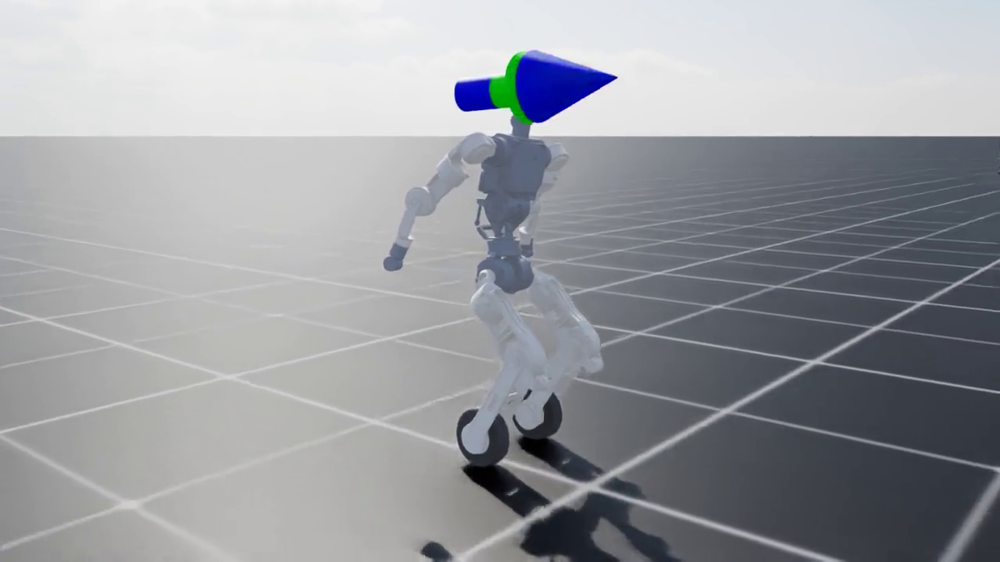
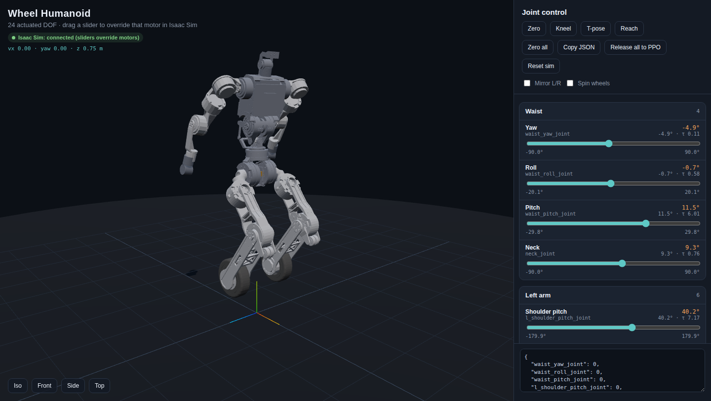

# Q1 Wheel (BI2 Wheel) URDF + Isaac Lab inline-skate RL

Quanta Q1 / BI2 wheeled-legged humanoid: ~1.4 m, **40 kg**, 24 CubeMars quasi-direct-drive joints, two
**actuated** Ø200 mm inline wheels, Xsens MTi-630 IMU on the pelvis, 200 Hz CAN. Trained in Isaac Lab
(Isaac Sim 5.1 / PhysX, RSL-RL PPO) to skate like the
[AgiBot Lingxi X2](https://www.youtube.com/watch?v=oJZ8tMIYlY4) (swizzle, forward lean, arms back,
micro-lift), with a sim2real-oriented plant instead of ideal PD.

```
config/q1_wheel_components.yaml   hardware sheet: motor SKUs, joint->motor map, IMU, CAN, wheel, mass target
docs/motors.md                    CubeMars datasheet numbers, assumptions, mass budget, sim actuator model
docs/spec/                        BI2 Wheel motor overview slide
docs/reference/                   X2 skate + A3 unbox MediaPipe traces / Q1 keyframes (see README_unbox.md)
urdf/wheel_humanoid_structural.urdf   CAD geometry + uniform-density masses (hand edited)
urdf/wheel_humanoid.urdf              GENERATED: tools/build_urdf.py (motors, 40 kg, imu_link, neck/wrist/gripper)
source/wheel_humanoid_lab/wheel_humanoid_lab/
  actuators/cubemars.py           CubeMarsActuator: V/I-limited BLDC + friction budget + delay + sag + DR
  assets/q1_spec.py               24-D joint contract, command block widths, SKU helpers
  assets/wheel_humanoid.py        Q1_WHEEL_CUBEMARS_CFG (actuator groups by SKU), skate stance keyframe
  tasks/manager_based/skate/      Isaac-Q1-Skate-v0: obs/action contract, rewards, curriculum, DR
  tasks/manager_based/unbox/      Isaac-Q1-Unbox-v0: supine → kneel (MediaPipe→web motor angles)
tests/test_skate_contract.py      obs/action/actuator contract unit test (Isaac Sim, 4 envs)
web/                              THREE.js joint UI (live motors + unbox keyframe scrubber/recorder)
tools/unbox_pose_extract.py       MediaPipe PoseLandmarker → Q1 trajectory / keyframes
tools/apply_unbox_recording.py    web motor-angle JSON → UNBOX_KNOTS in unbox_env_cfg.py
train_skate.sh / play_skateboard.sh / stop_isaac.sh   train, WASD play + web UI, kill leftover Kit
run_isaac.sh                      generic Isaac Sim runner
```

## Quick start

```bash
python tools/build_urdf.py                          # regenerate urdf/wheel_humanoid.urdf from the YAML
./run_isaac.sh tests/test_skate_contract.py         # contract test (must print ALL CHECKS PASSED)
NUM_ENVS=64 MAX_ITERS=5 ./train_skate.sh            # smoke test: reward names appear in the log
./train_skate.sh                                    # 4096 envs, curriculum stages 0-5 (see below)
./play_skateboard.sh                                # Isaac Sim + WASD + http://127.0.0.1:8766/web/
./stop_isaac.sh                                     # kill play/train/web and free GPU + ports
```

## Unbox from A3 reference (MediaPipe → web motors → RL)

Hand-tuned unbox rewards stalled (curriculum stuck at stage 3, kneel terms ≈ 0). The new loop
copies [AgiBot A3 unboxing](https://youtube.com/shorts/qCQSAEAf3Js) into Q1 joint space, lets you
correct motors on the URDF in the browser, then feeds those angles into `getup_track` / pose knots:

```bash
# extract (needs ~/projects/q1_wheel/.venv_media with mediapipe + yt-dlp)
python tools/unbox_pose_extract.py \
  --video docs/reference/a3_unbox_ref.mp4 \
  --model tools/models/pose_landmarker_heavy.task \
  --out docs/reference --overlay

# scrub / edit / record motor angles
python web/serve.py    # http://127.0.0.1:8765/web/ → Load A3 keyframes → Capture → Save for RL

# push into Isaac unbox env, then train
python tools/apply_unbox_recording.py \
  --recording docs/reference/a3_unbox_ref_web_recording.json
./train_unbox.sh
```

Details: [`docs/reference/README_unbox.md`](docs/reference/README_unbox.md).
## Play in Isaac Sim + web motor UI

`./play_skateboard.sh` loads `checkpoints/q1_skate_ppo.pt` in Isaac Sim, runs the PPO at 50 Hz, and
opens a browser at [http://127.0.0.1:8766/web/](http://127.0.0.1:8766/web/). The policy tracks a
body-frame twist `(vx, vy=0, yaw)`. Dragging a slider on the web page overrides that motor in the
sim; **Follow PPO** gives it back.





| Key | Command |
|---|---|
| W | roll forward (~1.2 m/s, ramped) |
| S | slow reverse (~0.35 m/s; policy barely trained reverse) |
| A / D | yaw left / right (not strafe — `vy` is always 0) |
| Q / E | extra yaw |
| Space / X / L | stop (Space no longer pauses the Isaac timeline) |
| R / Home | respawn at the skate pose |

Standalone web UI without Isaac: `python web/serve.py` then [http://127.0.0.1:8765/web/](http://127.0.0.1:8765/web/).

## Observation / action contract (hot-swappable)

Actor (92-D, float32, observation normalization ON and baked into the exported ONNX/JIT):

| block | dims | source |
|---|---|---|
| `imu_gyro` | 3 | MTi-630 on pelvis, 0–2 step delay, ±6° mounting tilt DR, noise |
| `imu_projected_gravity` | 3 | same IMU (not raw accel) |
| `joint_pos - default` | 24 | `Q1_JOINT_ORDER`, ±1.5° encoder bias, wheel angles wrapped to [-π, π) |
| `joint_vel` | 24 | 1 policy-step delay |
| `last_action` | 24 | unfiltered |
| command `twist` | 3 | `[vx, vy=0, yaw]` |
| command `head` / `body` | 4 / 6 | zero padded, reserved |
| command `arm_style` | 1 | 1 = arms-back skate |

Action (24-D): 22 position targets in `Q1_JOINT_ORDER` (wrist/gripper scale 0 = frozen) + 2 wheel
velocity targets (`l_wheel_joint`, `r_wheel_joint`, ×25 rad/s). Critic additionally sees base lin vel,
height, wheel rim speed, wheel normal force and air time. Control 50 Hz, PhysX 200 Hz (= CAN rate).

`Q1_JOINT_ORDER` = waist yaw/roll/pitch, neck, L shoulder p/r/y, L elbow, L wrist, L gripper, R shoulder
p/r/y, R elbow, R wrist, R gripper, L hip pitch/roll, L knee, R hip pitch/roll, R knee, L wheel, R wheel.

## Trained PPOs

| checkpoint | Gym task | action |
|---|---|---|
| `checkpoints/q1_skate_ppo.pt` | `Isaac-Q1-Skate-v0` | two-wheel stand, glide, lean, arms-back |
| `checkpoints/q1_slide_ppo.pt` | `Isaac-Q1-Slide-v0` | L/R front-back skate + passing-foot micro-lift |
| `checkpoints/q1_posture_ppo.pt` | `Isaac-Q1-Posture-v0` | kneel ↔ stand (the stand-up PPO) |
| `checkpoints/q1_unbox_ppo.pt` | `Isaac-Q1-Unbox-v0` | box-open supine → yoga sit-up → stable kneel |
| `checkpoints/q1_getup_ppo.pt` | (superseded) | first all-in-one get-up; stayed supine, do not use |
| `checkpoints/skateboard_ppo.pt` | `Isaac-WheelHumanoid-Skateboard-v0` | legacy ideal-PD stand-skate |

Open-box chain: lie face up → **unbox PPO** to a four-wheel kneel → **posture PPO** stands → skate/slide.

```bash
# Preferred: MediaPipe A3 clip → web motor angles → RL (see docs/reference/README_unbox.md)
python tools/apply_unbox_recording.py \
  --recording docs/reference/a3_unbox_ref_web_recording.json
./train_unbox.sh                 # supine → kneel (writes q1_unbox_ppo.pt)
# stand-up is already trained:
# ./train_posture.sh             # kneel ↔ stand
```

## Curriculum (`SKATE_STAGES`, PPO iterations)

| stage | from iter | what changes |
|---|---|---|
| 0 | 0 | stand/balance on two wheels, vx_cmd = 0, both wheels down |
| 1 | 300 | wheel-driven glide 0–0.6 m/s |
| 2 | 900 | swizzle: `leg_symmetry` 1.0, yaw ±0.3, braking −0.3 m/s, heading 0.5 |
| 3 | 1600 | `forward_lean` (torso gx target 0.17) + `arms_back` keyframe |
| 4 | 2400 | `skating_air_time` 0.3 (micro-lift 50–250 ms), vx up to 1.5 m/s |
| 5 | 3400 | pushes ±0.5 m/s, CoM DR ±3 cm, heading 1.0, vx up to 1.8 m/s |

`action_rate_l2` ramps −0.05 → −0.3 (iter 1500) → −0.6 (iter 4000). Reward names that must appear in
the log: `wheel_speed, leg_symmetry, grounded, forward_lean, arms_back, skating_air_time` (0 until stage 4).
Debug metrics under `Curriculum/metrics/*`: wheel ω, longitudinal/lateral slip, both/single contact
fraction, peak air time, torso pitch, shoulder pitch, AKE90 saturation %.

Terminations: trunk tilt > 0.6 rad, pelvis z < 0.60 m, torso/pelvis/arm/thigh ground contact, 20 s
time-out. Resume in a later stage with `RESUME=1 CHECKPOINT=... START_ITER=<iter> ./train_skate.sh`.

## Results (run `skate_cubemars_4096_v2`, 4096 envs, stage 5 reached at iter 3400)

[`docs/results/q1_skate_cubemars_iter3800.mp4`](docs/results/q1_skate_cubemars_iter3800.mp4) — 12 s
headless play of `checkpoints/q1_skate_ppo.pt` (iter 3800): coast 2 s → 0.6 → 1.2 → 1.5 m/s, heading
held at 0 through the yaw command. 8.15 m travelled, no fall, pelvis 0.75 m, final body vx 1.28 m/s.


Training metrics at iter 3700 (stage 5, pushes + CoM DR on): torso `projected_gravity_x` 0.164
(target 0.17), shoulder pitch 0.575 rad (keyframe 0.55), `leg_symmetry` 0.87, both-wheel contact 99.4 %,
wheel rim speed = base speed (0.456 vs 0.465 m/s → no sliding cheat), AKE90 saturation 0.1 %, mean
action std 0.19, 6.7 % of episodes terminated (pushes). Micro-lift has not emerged yet
(`skating_air_time` 0, single-contact 0.5 %); it is a weak late term by design and the run continues
to 20k iterations.

```bash
CHECKPOINT=logs/rsl_rl/q1_skate_cubemars/<run>/model_<n>.pt ./record_skate.sh   # new video
./record_skate.sh                                                             # checkpoints/q1_skate_ppo.pt
```

Exported policy with the observation normalizer baked in: `checkpoints/exported/q1_skate_policy.onnx`
(input `obs[1,92]` → `actions[1,24]`) and `q1_skate_policy.pt` (TorchScript).

### Lessons from run 1 (kept so they are not repeated)

- **Do not clip actions in the RL wrapper.** With `clip_actions=1.0` the policy pushed its means far
  outside [-1, 1]; the clipped action was then noise-free bang-bang, `action_rate_l2` saw ~0 and the
  entropy bonus grew the per-joint std to ~2.5 (arms flailing, `arms_back`/`forward_lean` ≈ 0). The
  bound now lives in joint space on the action terms (`default ± scale`, wheels ±25 rad/s), the raw
  action is penalised (`action_l2`), and std settles around 0.2. The runtime must apply the same clamp.
- Gaussian style rewards need a gradient from the starting pose: `forward_lean` std 0.12 (not 0.06),
  `arms_back` uses the per-joint RMS error (std 0.45 rad) instead of a sum over joints.
- `entropy_coef` 0.005 (spec said 0.01–0.03; 0.01 was part of the std runaway above).

---

# wheel_humanoid URDF (geometry notes)

URDF built from the 22 STLs in `URDF_Data_ME_stl_Update_20260911`. That STL set has no joint data, so
each joint origin was estimated from mesh geometry.

- Degrees of freedom: 19 actuated joints (waist 3, arms 4×2, legs 3×2, wheels 2) plus 2 knee-linkage
  rollers (mimic joints, not independent DOF)
- Frame: X forward, Y left, Z up, metres. Base link `pelvis` origin is the top of the pelvis (waist
  yaw motor face)
- Zero-pose height is 1.358 m; the wheel bottoms sit 0.8867 m below the pelvis origin

## Layout
```
urdf/wheel_humanoid.urdf        mesh paths are ../meshes/... relative
meshes/visual/                  original STLs (filenames unchanged)
meshes/collision/               convex hulls per link (≤1500 faces). Wheels and rollers are cylinders
isaaclab/wheel_humanoid_cfg.py  ArticulationCfg template
tools/set_masses.py             mass correction (scale total mass or inject CAD values)
tools/link_masses.csv           estimated mass per link (fill the cad_mass_kg column)
```

## How joint origins were chosen
Each motor axis came from a circle fit on a cross-section; the axial position was set by mating the
output flange to the child-link flange. These checks were used to confirm the guess:

- **Knee**: the thigh gear (6 mm face width) and shin gear faces line up at a 30 mm offset. The
  opposite thigh idler shaft (r 9.7) also seats in the shin plate bearing bore (r 9.75).
- **Wheel**: the shin bearing ring (r 55) and wheel bore (r 54.9) overlap at a 26 mm offset.
- **Waist**: U-joint cross length is symmetric in the yoke bearings. Pushrod tip vs `waist_yaw`
  socket error is within 0.2 mm.
- **Shoulder / elbow**: Ø98 motor rear (output) faces were matched to the same motor on other links.
  The upper arm then sits directly under the shoulder-roll motor (x error 0.07 mm).
- **Hip**: Ø107 motor output-hub face was mated to the child centering lip. Hip roll also matches
  the rear stub to the thigh bore.

| Joint | Parent → child | Origin xyz (mm) | Axis | Limits (rad, provisional) | Torque N·m / speed rad/s (provisional) |
|---|---|---|---|---|---|
| `waist_yaw_joint` | pelvis → waist_yaw_link | 0.00, 0.00, 0.00 | Z | -1.57 ~ 1.57 | 30 / 10 |
| `waist_roll_joint` | waist_yaw_link → waist_roll_link | 0.00, 0.00, 37.80 | X | -0.35 ~ 0.35 | 40 / 6 |
| `waist_pitch_joint` | waist_roll_link → torso | 0.00, 0.00, 0.00 | Y | -0.52 ~ 0.52 | 40 / 6 |
| `l_shoulder_pitch_joint` | torso → l_shoulder_pitch_link | 0.00, 140.50, 256.00 | Y | -3.14 ~ 3.14 | 30 / 10 |
| `l_shoulder_roll_joint` | l_shoulder_pitch_link → l_shoulder_roll_link | -30.19, 75.00, 0.00 | X | -0.2 ~ 2.6 | 30 / 10 |
| `l_shoulder_yaw_joint` | l_shoulder_roll_link → l_shoulder_yaw_link | 30.12, 0.00, -141.70 | Z | -1.57 ~ 1.57 | 30 / 10 |
| `l_elbow_joint` | l_shoulder_yaw_link → l_elbow_link | 0.00, 30.00, -120.00 | Y | -2.5 ~ 0.2 | 30 / 10 |
| `r_shoulder_pitch_joint` | torso → r_shoulder_pitch_link | 0.00, -140.50, 256.00 | Y | -3.14 ~ 3.14 | 30 / 10 |
| `r_shoulder_roll_joint` | r_shoulder_pitch_link → r_shoulder_roll_link | -30.19, -75.00, 0.00 | X | -2.6 ~ 0.2 | 30 / 10 |
| `r_shoulder_yaw_joint` | r_shoulder_roll_link → r_shoulder_yaw_link | 30.12, 0.00, -141.70 | Z | -1.57 ~ 1.57 | 30 / 10 |
| `r_elbow_joint` | r_shoulder_yaw_link → r_elbow_link | 0.00, -30.00, -120.00 | Y | -2.5 ~ 0.2 | 30 / 10 |
| `l_hip_pitch_joint` | pelvis → l_hip_pitch_link | 0.00, 84.00, -126.70 | Y | -1.8 ~ 1.2 | 60 / 12 |
| `l_hip_roll_joint` | l_hip_pitch_link → l_thigh_link | 27.00, 73.00, -98.00 | X | -0.35 ~ 0.8 | 60 / 12 |
| `l_knee_joint` | l_thigh_link → l_shin_link | -27.00, -30.00, -222.00 | Y | -0.2 ~ 2.6 | 60 / 12 |
| `l_wheel_joint` | l_shin_link → l_wheel_link | 0.00, 26.00, -340.00 | Y | continuous | 20 / 30 |
| `r_hip_pitch_joint` | pelvis → r_hip_pitch_link | 0.00, -84.00, -126.70 | Y | -1.8 ~ 1.2 | 60 / 12 |
| `r_hip_roll_joint` | r_hip_pitch_link → r_thigh_link | 27.00, -68.00, -98.00 | X | -0.8 ~ 0.35 | 60 / 12 |
| `r_knee_joint` | r_thigh_link → r_shin_link | -27.00, 30.00, -222.00 | Y | -0.2 ~ 2.6 | 60 / 12 |
| `r_wheel_joint` | r_shin_link → r_wheel_link | 0.00, -26.00, -340.00 | Y | continuous | 20 / 30 |
| `l_knee_roller_joint` | l_thigh_link → l_knee_roller_link | -27.00, -47.60, -222.00 | Y | -0.1 ~ 1.2 (mimic) | 60 / 12 |
| `r_knee_roller_joint` | r_thigh_link → r_knee_roller_link | -27.00, 47.10, -222.00 | Y | -0.1 ~ 1.2 (mimic) | 60 / 12 |

Sign convention: left and right joints share the same axis directions (+X/+Y/+Z). Negative hip pitch
swings the leg forward; positive knee folds the shin backward.

## Knee-roller linkage
The gear on `lower_leg_*_w_link_1_2` is a 72T (module 1) sector that spins on the knee axis. Two
rollers (r 25 mm) sit at the end of the lever.

Gear train: shin 52T (on the knee axis, fixed to the shin) → thigh compound idler 52T/32T (52 mm
above the knee) → roller sector 72T.

- Centre distance idler–knee 52 mm matches both pitch-radius sums (26+26 and 16+36).
- Two external meshes, so the roller turns the same way as the knee relative to the thigh. Ratio
  32/72 = 0.444.
- Relative to the shin the roller rotates −0.556× the knee angle, so folding the knee brings the
  rollers forward under the knee.

URDF uses `<mimic joint="*_knee_joint" multiplier="0.444444"/>` with the thigh as parent.
- Isaac Sim 4.5+ URDF import turns mimic into a PhysX mimic joint. Older versions ignore mimic and
  leave a free joint — then lock it or drive it from the knee angle.
- Not included in any actuator group.

## Items to verify
1. **Left/right asymmetry**: hip-roll motor at L +73 mm vs R −68 mm (5 mm). That offset is in
   `05_urdf_thigh_joint_r.stl`, so it was kept. Confirm it is intentional.
2. **Knee-roller gear alignment**: lever axial position was set from gear-face alignment. At that
   pose the opposite 8.5 mm plate overlaps the thigh motor rear hub (r 35) by ~3 mm. Check the real
   assembly gap.
3. **Waist parallel mechanism**: the two motors and pushrods in the torso were simplified to serial
   yaw→roll→pitch. Pushrods live in the torso mesh, so they move as a rigid body with the waist.
4. **Mass / inertia**: every link assumed uniform 1000 kg/m³ (18.39 kg total). Motors and metal come
   out light — correct with `tools/set_masses.py`.
5. **Joint limits, torque, speed, gains**: all provisional.
6. **Collision**: convex hulls overlap non-adjacent links (`waist_yaw`↔torso, roller↔shin, …). Keep
   self-collision off. For tighter collision, use the Isaac Lab URDF importer convex-decomposition
   option.

## Usage
```bash
# Mass correction
python tools/set_masses.py --total 32.0                  # scale to a measured total mass
python tools/set_masses.py --csv tools/link_masses.csv   # replace links that have cad_mass_kg

# Isaac Lab URDF → USD (2.x)
./isaaclab.sh -p scripts/tools/convert_urdf.py urdf/wheel_humanoid.urdf wheel_humanoid.usd --joint-stiffness 0.0 --joint-damping 0.0
```
`isaaclab/wheel_humanoid_cfg.py` is a template that spawns the URDF directly. Check API names such as
`effort_limit_sim` against your Isaac Lab version.

## Legacy standing-skate PPO (`Isaac-WheelHumanoid-Skateboard-v0`)

Older upright two-wheel skate task (ideal implicit PD, not the CubeMars Q1 plant). Knee rollers stay
off the ground. Use `./train_skate.sh` / `./play_skateboard.sh` for the current Q1 policy instead.

```bash
./train_skateboard.sh           # writes checkpoints/skateboard_ppo.pt
RESUME=1 MAX_ITERS=3000 ./train_skateboard.sh
./record_stand_skate.sh         # headless RGB of the legacy checkpoint
```

## Link ↔ source STL
| Link | STL |
|---|---|
| `pelvis` | `hip.stl` |
| `waist_yaw_link` | `waist_yaw.stl` |
| `waist_roll_link` | `waist_pitch.stl` |
| `torso` | `waist_should_head.stl` |
| `l_shoulder_pitch_link` | `ARM_L/arm_l_link_1.stl` |
| `l_shoulder_roll_link` | `ARM_L/arm_l_link_2.stl` |
| `l_shoulder_yaw_link` | `ARM_L/arm_l_link_3.stl` |
| `l_elbow_link` | `ARM_L/arm_l_link_4.stl` |
| `r_shoulder_pitch_link` | `ARM_R/arm_r_link_1.stl` |
| `r_shoulder_roll_link` | `ARM_R/arm_r_link_2.stl` |
| `r_shoulder_yaw_link` | `ARM_R/arm_r_link_3.stl` |
| `r_elbow_link` | `ARM_R/arm_r_link_4.stl` |
| `l_hip_pitch_link` | `UPPER_LEG_L/05_urdf_thigh_joint_l.stl` |
| `l_thigh_link` | `UPPER_LEG_L/05_urdf_thigh_knee_l.stl` |
| `l_shin_link` | `LOWER_LEG/LOWER_LEG_L_W/lower_leg_l_w_link_1_1.stl` |
| `l_wheel_link` | `LOWER_LEG/LOWER_LEG_L_W/lower_leg_l_w_link_2.stl` |
| `r_hip_pitch_link` | `UPPER_LEG_R/05_urdf_thigh_joint_r.stl` |
| `r_thigh_link` | `UPPER_LEG_R/05_urdf_thigh_knee_r.stl` |
| `r_shin_link` | `LOWER_LEG/LOWER_LEG_R_W/lower_leg_r_w_link_1_1.stl` |
| `r_wheel_link` | `LOWER_LEG/LOWER_LEG_R_W/lower_leg_r_w_link_2.stl` |
| `l_knee_roller_link` | `LOWER_LEG/LOWER_LEG_L_W/lower_leg_l_w_link_1_2.stl` |
| `r_knee_roller_link` | `LOWER_LEG/LOWER_LEG_R_W/lower_leg_r_w_link_1_2.stl` |
